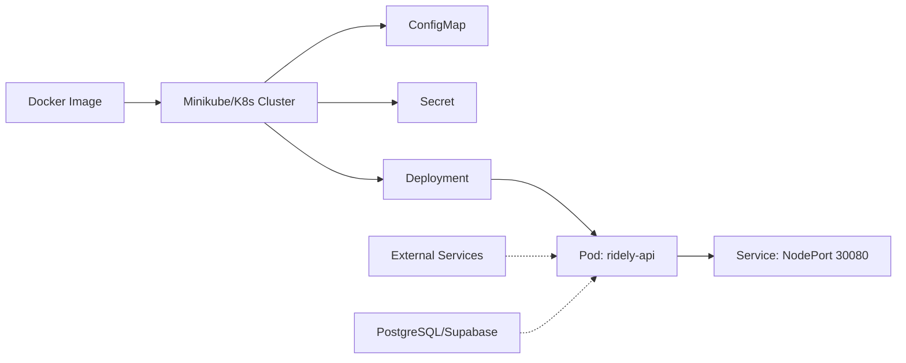
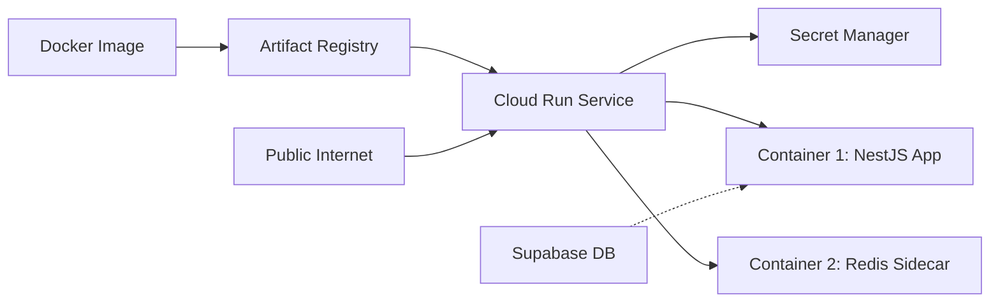
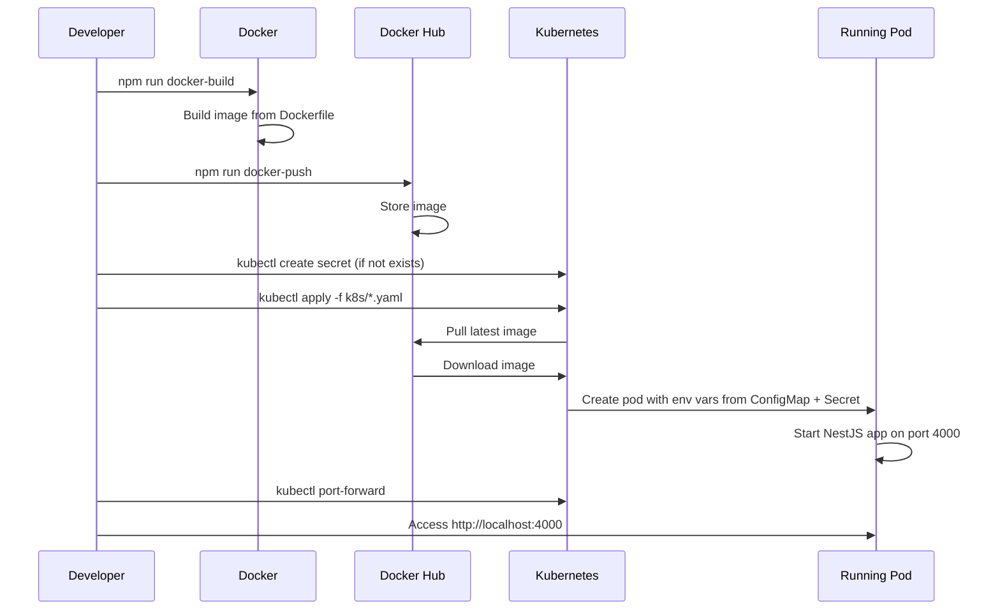
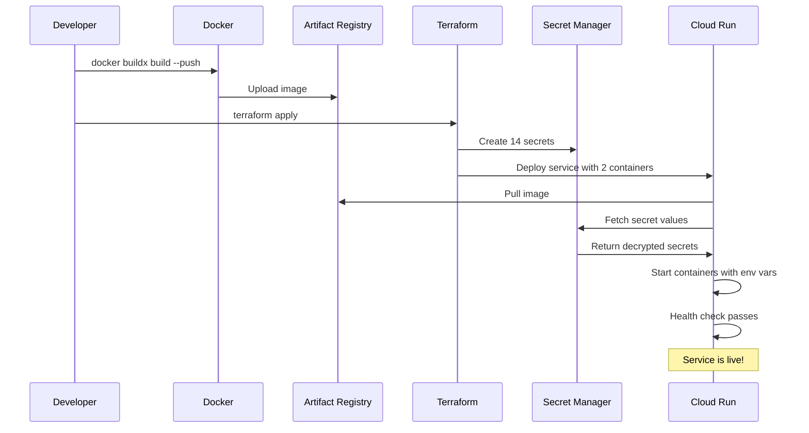

# DevOps Guide - Ridely API Deployment

This guide explains how to deploy the Ridely API to different environments using Kubernetes (local/development) and Google Cloud Run (staging/production).

## Table of Contents

1. [Architecture Overview](#architecture-overview)
2. [Kubernetes Deployment (Local)](#kubernetes-deployment-local)
3. [Cloud Run Deployment (Staging)](#cloud-run-deployment-staging)
4. [Secrets Management](#secrets-management)
5. [Common Operations](#common-operations)
6. [Troubleshooting](#troubleshooting)

---

## Architecture Overview

The Ridely API is a **NestJS** application that can be deployed in two ways:

### Local Development (Kubernetes)



### Staging/Production (Cloud Run)



---

## Kubernetes Deployment (Local)

### Prerequisites

- Docker Desktop installed
- Minikube or Docker Desktop Kubernetes enabled
- `kubectl` CLI installed
- Access to `.env.k8s.secrets` file (ask team lead)

### File Structure

```
ridely/
├── Dockerfile              # Defines how to build the Docker image
├── k8s/
│   ├── app.yaml           # Main deployment and service configuration
│   ├── configmap-app.yaml # Non-sensitive environment variables
│   └── secret-main.yaml   # Sensitive credentials (gitignored)
├── package.json           # npm scripts for deployment
└── .env.k8s.secrets       # Source of truth for secrets (gitignored)
```

### How It Works

#### Step 1: Build Docker Image

```bash
npm run docker-build
```

**What happens:**

- Reads `Dockerfile`
- Builds the NestJS app (`yarn build`)
- Copies `dist/` folder and dependencies to a lightweight Node.js image
- Tags the image as `joemartin2001/ridely-api:latest`

#### Step 2: Push to Docker Hub

```bash
npm run docker-push
```

**What happens:**

- Uploads the image to Docker Hub registry
- Makes it available for Kubernetes to pull

#### Step 3: Create Kubernetes Secret

```bash
kubectl create secret generic ridely-api-secret \
  --from-env-file=.env.k8s.secrets \
  --namespace=ridely
```

**What happens:**

- Reads all variables from `.env.k8s.secrets`
- Creates a Kubernetes Secret object
- Stores values as base64-encoded strings
- **Note:** This secret is NOT in version control for security

#### Step 4: Apply Kubernetes Manifests

```bash
kubectl apply -f k8s/configmap-app.yaml -n ridely
kubectl apply -f k8s/app.yaml -n ridely
```

**What happens:**

**ConfigMap** (`configmap-app.yaml`):

- Stores non-sensitive config (PORT, NODE_ENV, FRONTEND_URL)
- Mounted as environment variables in the pod

**Deployment** (`app.yaml`):

- Defines the desired state: 1 replica of `ridely-api`
- Uses image `joemartin2001/ridely-api:latest`
- **Always pulls** new image (`imagePullPolicy: Always`)
- Injects environment variables from:
  - ConfigMap (`configMapRef`)
  - Secret (`secretRef`)
- Exposes port 4000

**Service**:

- Creates a stable network endpoint
- Type: `NodePort` (accessible from outside cluster)
- Maps port 4000 → 30080

#### Step 5: Access the Application

```bash
kubectl port-forward svc/ridely-api 4000:4000 -n ridely
```

Now visit: http://localhost:4000

### Deployment Workflow Diagram



### Quick Commands

```bash
# Full deployment (build, push, restart)
npm run docker-build && npm run docker-push && npm run kube-rollout-restart

# View logs
npm run kube-logs

# Check pod status
kubectl get pods -n ridely

# Describe pod (for debugging)
kubectl describe pod <pod-name> -n ridely
```

---

## Cloud Run Deployment (Staging)

### Prerequisites

- Google Cloud CLI (`gcloud`) installed and authenticated
- Terraform installed
- Access to `infra/secrets.auto.tfvars` (contains actual secret values)
- Docker configured for Google Artifact Registry

### File Structure

```
ridely/
├── infra/
│   ├── main.tf              # Terraform provider config
│   ├── variables.tf         # Input variable definitions
│   ├── cloud_run.tf         # Cloud Run service definition
│   ├── secrets.tf           # Secret Manager resources
│   ├── staging.tfvars       # Non-sensitive staging config
│   └── secrets.auto.tfvars  # Sensitive values (gitignored)
└── Dockerfile               # Same image used for both K8s and Cloud Run
```

### How It Works

#### Infrastructure Overview

**Terraform** is an Infrastructure as Code (IaC) tool. Instead of clicking buttons in Google Cloud Console, you define your infrastructure in `.tf` files.

**What Terraform Manages:**

1. **Google Secret Manager** - Stores sensitive credentials
2. **Cloud Run Service** - Runs the Docker container
3. **IAM Permissions** - Controls access to secrets and public access

#### Step 1: Build and Push Docker Image

```bash
cd /Users/sardorbek/projects/ridely
docker buildx build --platform=linux/amd64 \
  -t europe-central2-docker.pkg.dev/ridely-staging/ridely-staging/ridely-api:latest \
  --push .
```

**What happens:**

- Builds for Linux (Cloud Run requirement)
- Pushes to **Google Artifact Registry** (not Docker Hub)
- Tagged with full registry path

#### Step 2: Initialize Terraform

```bash
cd infra/
terraform init
```

**What happens:**

- Downloads Google Cloud provider plugin
- Prepares Terraform to manage GCP resources

#### Step 3: Review Changes

```bash
terraform plan -var-file=staging.tfvars
```

**What happens:**

- Compares desired state (your `.tf` files) vs actual state (what exists in GCP)
- Shows what will be created/modified/destroyed
- **Does NOT make changes yet**

#### Step 4: Apply Infrastructure

```bash
terraform apply -var-file=staging.tfvars -auto-approve
```

**What happens:**

**Phase 1: Create Secrets** (`secrets.tf`)

1. Creates 14 secrets in Google Secret Manager:
   - `jwt-secret`, `db-password`, `gmail-pass`, etc.
2. Stores actual values from `secrets.auto.tfvars`
3. Grants Cloud Run service account read access

**Phase 2: Deploy Cloud Run** (`cloud_run.tf`)

1. Creates/updates Cloud Run service
2. **Main container** (ridely-api):
   - Uses your Docker image
   - Injects non-sensitive env vars from `staging.tfvars`
   - Injects sensitive env vars from Secret Manager
   - Allocates 1 CPU, 1Gi memory
3. **Sidecar container** (Redis):
   - Runs `redis:alpine`
   - Shares `localhost` network with main container
4. **Networking**:
   - Auto-scales 0-5 instances
   - Public access enabled via IAM

**Phase 3: Public Access**

- Grants `allUsers` the `roles/run.invoker` role
- Makes the service publicly accessible

#### Step 5: Access the Application

The service is live at:

```
https://ridely-api-staging-2s5tki2knq-lm.a.run.app
```

### Cloud Run Deployment Diagram



### Environment Variables Flow

**Non-Sensitive** (`staging.tfvars` → `cloud_run.tf` → Container)

```hcl
# staging.tfvars
env_vars = {
  DB_HOST = "aws-0-eu-central-1.pooler.supabase.com"
  REDIS_HOST = "localhost"
}

# cloud_run.tf
dynamic "env" {
  for_each = var.env_vars
  content {
    name  = env.key
    value = env.value
  }
}
```

**Sensitive** (`secrets.auto.tfvars` → Secret Manager → Container)

```hcl
# secrets.auto.tfvars
secrets = {
  "db-password" = "ridely@00!"
}

# secrets.tf
resource "google_secret_manager_secret_version" "secret_versions" {
  secret      = google_secret_manager_secret.secrets[each.key].id
  secret_data = var.secrets[each.key]
}

# cloud_run.tf
env {
  name = "DB_PASSWORD"
  value_source {
    secret_key_ref {
      secret  = google_secret_manager_secret.secrets["db-password"].secret_id
      version = "latest"
    }
  }
}
```

---

## Secrets Management

### Kubernetes (Local)

**File:** `.env.k8s.secrets` (gitignored)

```bash
NODE_ENV=production
DB_PASSWORD=ridely@00!
JWT_SECRET=9fab5279-b888-4c8c-8fc6-ce5523a02cf3
...
```

**Storage:** Kubernetes Secret object (base64 encoded in cluster)

**How to update:**

```bash
# Delete old secret
kubectl delete secret ridely-api-secret -n ridely

# Recreate with new values
kubectl create secret generic ridely-api-secret \
  --from-env-file=.env.k8s.secrets \
  --namespace=ridely

# Restart pods to pick up new values
kubectl rollout restart deployment/ridely-api -n ridely
```

### Cloud Run (Staging/Production)

**Files:**

- `secrets.auto.tfvars` (gitignored) - contains actual secret values
- `staging.tfvars` (can be versioned) - contains non-sensitive config

**Storage:** Google Secret Manager

**How to update:**

```bash
# 1. Edit secrets.auto.tfvars with new values
vim infra/secrets.auto.tfvars

# 2. Apply changes
cd infra/
terraform apply -var-file=staging.tfvars -auto-approve
```

Terraform will:

- Update secret versions in Secret Manager
- Redeploy Cloud Run service
- Pods pick up new values automatically

### Security Best Practices

✅ **DO:**

- Keep `secrets.auto.tfvars` and `.env.k8s.secrets` in `.gitignore`
- Store sensitive files locally or in a password manager
- Rotate secrets regularly
- Use different secrets for each environment

❌ **DON'T:**

- Commit secrets to version control
- Share secrets via Slack/email
- Use production secrets in development
- Hardcode secrets in application code

---

## Common Operations

### Update Application Code

**Kubernetes:**

```bash
# 1. Make code changes
# 2. Build new image
npm run docker-build

# 3. Push to registry
npm run docker-push

# 4. Force pod to pull new image
npm run kube-rollout-restart
```

**Cloud Run:**

```bash
# 1. Make code changes
# 2. Build and push
docker buildx build --platform=linux/amd64 \
  -t europe-central2-docker.pkg.dev/ridely-staging/ridely-staging/ridely-api:latest \
  --push .

# 3. Force Cloud Run to use new image
cd infra/
terraform taint google_cloud_run_v2_service.api
terraform apply -var-file=staging.tfvars -auto-approve
```

### View Logs

**Kubernetes:**

```bash
npm run kube-logs
# or
kubectl logs -f deployment/ridely-api -n ridely
```

**Cloud Run:**

```bash
gcloud logging read "resource.type=cloud_run_revision AND resource.labels.service_name=ridely-api-staging" \
  --limit=50 \
  --project=ridely-staging
```

### Scale Application

**Kubernetes:**

```bash
kubectl scale deployment ridely-api --replicas=3 -n ridely
```

**Cloud Run:**
Edit `cloud_run.tf`:

```hcl
scaling {
  min_instance_count = 1  # changed from 0
  max_instance_count = 10 # changed from 5
}
```

Then: `terraform apply -var-file=staging.tfvars -auto-approve`

---

## Troubleshooting

### Kubernetes Issues

**Problem:** Pod stuck in `ImagePullBackOff`

```bash
kubectl describe pod <pod-name> -n ridely
```

**Solution:** Check if image exists in Docker Hub and pull policy is correct

**Problem:** Pod crashes immediately

```bash
kubectl logs <pod-name> -n ridely
```

**Solution:** Check for missing environment variables or database connection issues

**Problem:** Changes not reflecting
**Solution:** Ensure `imagePullPolicy: Always` in `k8s/app.yaml`

### Cloud Run Issues

**Problem:** Container failed to start

```bash
gcloud logging read "resource.type=cloud_run_revision AND resource.labels.service_name=ridely-api-staging" \
  --limit=20 \
  --project=ridely-staging
```

**Solution:** Check logs for validation errors or missing secrets

**Problem:** 503 Service Unavailable
**Solution:** Check if the service is still deploying or if health check is failing

**Problem:** Database connection timeout
**Solution:** Verify `SUPABASE_DATABASE_URL` password encoding and network connectivity

---

## Key Differences: K8s vs Cloud Run

| Aspect              | Kubernetes (Local)               | Cloud Run (Staging)                    |
| ------------------- | -------------------------------- | -------------------------------------- |
| **Secrets**         | `.env.k8s.secrets` → K8s Secret  | `secrets.auto.tfvars` → Secret Manager |
| **Image Registry**  | Docker Hub                       | Google Artifact Registry               |
| **Networking**      | NodePort (30080)                 | HTTPS (managed by Google)              |
| **Scaling**         | Manual                           | Automatic (0-5)                        |
| **Redis**           | External (configured separately) | Sidecar container                      |
| **SSL**             | Not configured                   | Automatic (Google-managed)             |
| **Cost**            | Free (local)                     | Pay per request                        |
| **Deployment Tool** | `kubectl`                        | Terraform                              |

---

## Quick Reference

### Kubernetes Commands

```bash
# Build and deploy
npm run docker-build && npm run docker-push && npm run kube-rollout-restart

# View logs
npm run kube-logs

# Port forward
kubectl port-forward svc/ridely-api 4000:4000 -n ridely

# Get pod status
kubectl get pods -n ridely

# Recreate secret
kubectl delete secret ridely-api-secret -n ridely
kubectl create secret generic ridely-api-secret --from-env-file=.env.k8s.secrets -n ridely
```

### Terraform/Cloud Run Commands

```bash
# Build and push image
docker buildx build --platform=linux/amd64 \
  -t europe-central2-docker.pkg.dev/ridely-staging/ridely-staging/ridely-api:latest \
  --push .

# Deploy infrastructure
cd infra/
terraform init
terraform plan -var-file=staging.tfvars
terraform apply -var-file=staging.tfvars -auto-approve

# Force redeploy
terraform taint google_cloud_run_v2_service.api
terraform apply -var-file=staging.tfvars -auto-approve

# View logs
gcloud logging read "resource.type=cloud_run_revision AND resource.labels.service_name=ridely-api-staging" --limit=50 --project=ridely-staging
```

---

## Next Steps

1. **Run migrations manually**: Use Supabase Session Pooler (port 5432) instead of Transaction Pooler
2. **Set up CI/CD**: Automate deployments with GitHub Actions
3. **Configure custom domain**: Map `api-staging.ridely.uz` to Cloud Run
4. **Enable monitoring**: Set up alerts for errors and performance issues
5. **Create production environment**: Duplicate staging setup with production secrets

---

**Need help?** Ask the team lead or check the [NestJS docs](https://docs.nestjs.com/) and [Google Cloud Run docs](https://cloud.google.com/run/docs).
